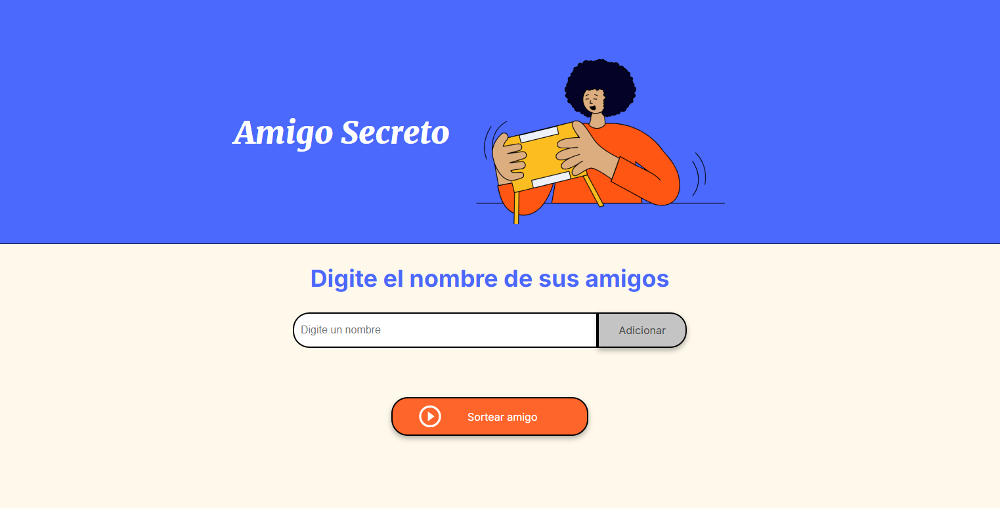

## :question: MI AMIGO SECRETO :question:

- [Descripción del proyecto](#descripción-del-proyecto)

- [Estado del proyecto](#Estado-del-proyecto)

- [Funcionalidades del proyecto](#Funcionalidades-del-proyecto)

- [Acceso al proyecto](#acceso-proyecto)

- [Tecnologías utilizadas](#tecnologías-utilizadas)

- [Personas Contribuyentes](#personas-contribuyentes)

- [Conclusión](#conclusión)

## Descripción del proyecto

Mi amigo secreto es una aplicacion web que permite a los usuarios utilizarla cuand tengan que realizr un sorteo de amigo secreto en sus evento familiares, sociales o academicos. Esta aplicacion permite ingresar una variedad de nombres y tiene la funcionalidad de sortear un nombre aleatorio, siendo este el resultado de tu amigo secreto.

## Estado del proyecto :+1:

El proyecto se encuentra finalizado y esta disponible para ser usado por los usuarios.

## :hammer: Funcionalidades del proyecto

- `Funcionalidad 1`: Ingresar lista de nombres.
- `Funcionalidad 2`: Elige un nombre aleatorio.

## :file_folder: Acceso al proyecto

Puedes acceder a la aplicacion a traves del siguiente enlace:

https://karen17mendoza.github.io/Amigo-Secreto/

## :computer: Tecnologías utilizadas

- JavaScript
- HTML
- CSS

## Personas Contribuyentes

[ Karen Mendoza](https://github.com/Karen17Mendoza) |

## Conclusion

Este proyecto es un reto del curso de ALURA. Fue realizado con exito y del cual aprendi bastante.
